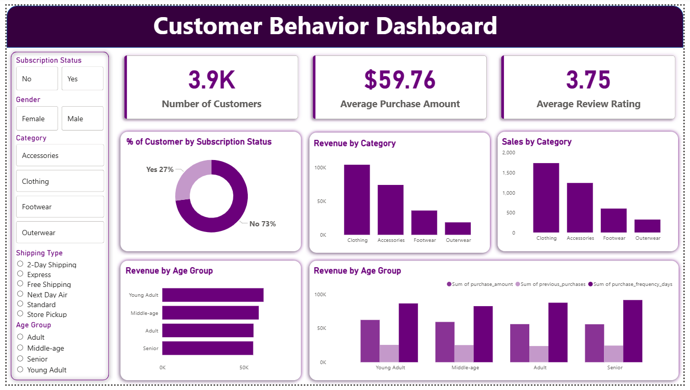

> # Customer Shopping Behavior Dashboard

## Overview
This project analyzes customer purchasing data to identify shopping patterns and spending behavior. The dashboard helps visualize customer preferences and sales distribution across product categories.

## Dataset
The dataset includes **customer purchase data with multiple attributes** such as product category, purchase value, and customer activity.

## Tools & Technologies
- Excel
- SQL
- Python
- Power BI

## Project Workflow
1. Data cleaning and preprocessing.
2. Exploratory Data Analysis using Python.
3. SQL queries to extract insights.
4. Dashboard development in Power BI.

## Key Insights
- Identified **customer spending patterns** across categories.
- Analyzed **popular product segments**.
- Visualized **sales distribution and purchasing trends**.

## Dashboard

